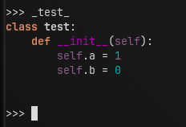

```python
def main(api: dict, command_context: dict, plugin_space: dict):
    data = api["data"] 
    PFT =  api["PFT"] # print formated text(with syntax highlighting(python3))
    PFT(
        """
class test:
    def __init__(self):
        self.a = 1
        self.b = 0        
        """, # text
        data
    )
    """
    PFT signature - PFT(text: str, data: Data)
    """
```
```pycon
>>> _test_
class test:
    def __init__(self):
        self.a = 1
        self.b = 0


>>>
```

