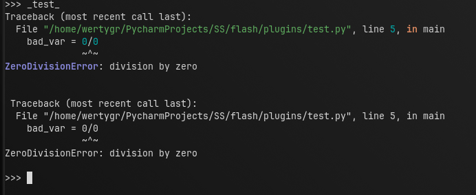

<details> <summary>post</summary>

```python
from plugins.plugin_tools.types import (PluginData, PluginApi, CommandContext)

def main(api: PluginApi, command_context: CommandContext, plugin_space: dict):
    data = api["data"]
    post = api["post"]
    try:
        bad_var = 0/0
    except Exception as e:
        post(e, data)
        print("\n", data.last_error)
    """
    post signature - post(e: Any, data: Data)
    """
```

```pycon
>>> _test_
Traceback (most recent call last):
  File "/home/wertygr/PycharmProjects/SS/flash/plugins/test.py", line 5, in main
    bad_var = 0/0
              ~^~
ZeroDivisionError: division by zero


 Traceback (most recent call last):
  File "/home/wertygr/PycharmProjects/SS/flash/plugins/test.py", line 5, in main
    bad_var = 0/0
              ~^~
ZeroDivisionError: division by zero

>>>
```

</details>